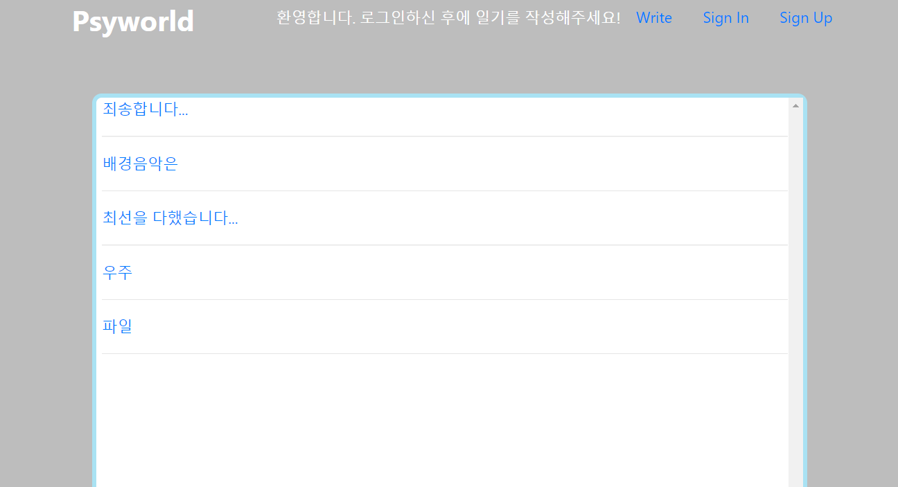

# Psyworld



- 여러분은 싸이월드를 기억하시나요? 😁 저와 같은 90년대생 아재 분들은 한 번쯤 해보셨을 것입니다. 
- 이제는 추억 속으로 사라진 싸이월드.... 이 추억의 파도타기 장소를 그리워했던 저는 첫 번째 웹 수업의 결과물로 **```싸이월드```**를 최대한 재현해보고자 했습니다.
- 그렇게 해서 만들어진 것이 바로 이 Psyworld입니다!😉 웹을 생판 처음 배울 때 만든 것이라 조잡하기 그지 없지만 최대한 싸이월드의 감성을 살려보려고 노력했습니다.😂
- 한 가지 비밀! 원래 Psyworld에 접속하면 프리스타일의 Y가 흘러나왔습니다! 이 기능을 구현하기 위해 멜론에서 돈 주고 노래를 샀답니다. 추억의 띵곡.... 다시 들어도 좋더군요. My~ baby~ I love you so much~ 🎵
- 하지만 저작권을 지키기 위해 이 Repository에서는 뺏습니다.😝 Psyworld에서 Y를 듣고 싶으시다면 음원을 사신 다음에 **myproject/player/static/app name/audio** 폴더에 넣어주세요!